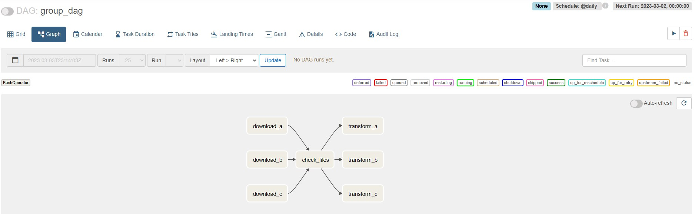
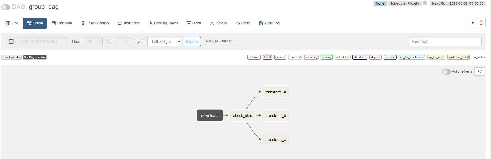
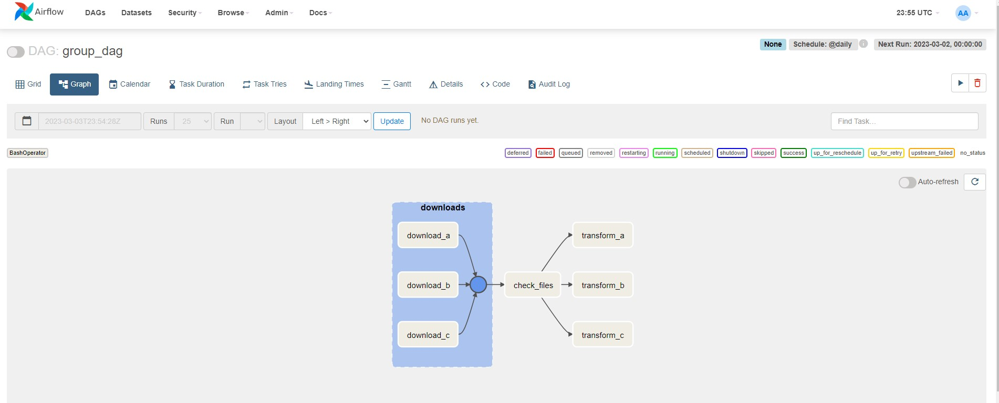

# Notes

## Create a DAG
Whenever you create a DAG, there are a couple of things you always need to define.

1. Import the DAG object
2. Instantiate a the DAG object
3. Define a unique dag id
4. Define a start date
5. Define a scheduled interval
6. Define the catchup parameter

```python
from airflow import DAG
from airflow.providers.postgres.operators.postgres import PostgresOperator
from airflow.providers.http.sensors.http import HttpSensor
from datetime import datetime

with DAG('user_processing', start_date=datetime(2023,3,1), 
        schedule_interval='@daily', catchup=False) as dag:
```

## Create a Task
They are 2 steps that you will always do when you create a task:  
1. Import the operator
2. Define the task id

Remember, the task id must be unique across all tasks in the same DAG.

That being said, create the task create_table with:
```python

with DAG('user_processing', start_date=datetime(2023,3,1), 
        schedule_interval='@daily', catchup=False) as dag:
    
        create_table = PostgresOperator(
        task_id='create_table', #keep same name for variable and task ID
        postgres_conn_id='postgres', #Define this connection in Airflow UI
        sql='''
            CREATE TABLE IF NOT EXISTS users (
                firstname TEXT NOT NULL,
                lastname TEXT NOT NULL,
                country TEXT NOT NULL,
                username TEXT NOT NULL,
                password TEXT NOT NULL,
                email TEXT NOT NULL
            );
        '''
        )
```

## When adding a new task to DAG, always test it

```bash
$ docker-compose ps
NAME                                 IMAGE                  COMMAND                  SERVICE             CREATED             STATUS                    PORTS
airflow_docker-airflow-scheduler-1   apache/airflow:2.3.4   "/usr/bin/dumb-init …"   airflow-scheduler   48 minutes ago      Up 35 minutes (healthy)   8080/tcp
airflow_docker-airflow-triggerer-1   apache/airflow:2.3.4   "/usr/bin/dumb-init …"   airflow-triggerer   48 minutes ago      Up 35 minutes (healthy)   8080/tcp
airflow_docker-airflow-webserver-1   apache/airflow:2.3.4   "/usr/bin/dumb-init …"   airflow-webserver   48 minutes ago      Up 35 minutes (healthy)   0.0.0.0:8080->8080/tcp
airflow_docker-postgres-1            postgres:13            "docker-entrypoint.s…"   postgres            49 minutes ago      Up 35 minutes (healthy)   5432/tcp

$ docker exec -it airflow_docker-airflow-scheduler-1 /bin/bash
airflow@8ac4beaf7e4c:/opt/airflow$ airflow tasks test user_processing create_table 2022-03-01
[2023-03-03 18:29:45,034] {base.py:68} INFO - Using connection ID 'postgres' for task execution.
[2023-03-03 18:29:45,043] {sql.py:315} INFO - Running statement: CREATE TABLE IF NOT EXISTS users (
                firstname TEXT NOT NULL,
                lastname TEXT NOT NULL,
                country TEXT NOT NULL,
                username TEXT NOT NULL,
                password TEXT NOT NULL,
                email TEXT NOT NULL
            ), parameters: None
[2023-03-03 18:29:45,336] {taskinstance.py:1412} INFO - Marking task as SUCCESS. dag_id=user_processing, task_id=create_table, execution_date=20220301T000000, start_date=, end_date=20230303T182945  
```

exit with Ctrl-d

## Ad a Sensor

A sensor is a special type of operator.
It waits for something to happen before executing the next task.

For example, if you want to wait for files, you can use the FileSensor.

If you want to wait for an entry in an S3 bucket, you can use the S3KeySensor.

## Implement a sensor for api 
```python
    is_api_available = HttpSensor(
            task_id='is_api_available', 
            http_conn_id='user_api', 
            endpoint='api/'    
        )
```

Create the connection user_api on UI
```
Name: user_api    
Connection type: HTTP  
Host: https://randomuser.me/
```

## Implement a task to extract users from api 
```python
    extract_user = SimpleHttpOperator(
            task_id='extract_user',
            http_conn_id='user_api',
            endpoint='api/',
            method='GET',
            response_filter=lambda response: json. loads(response. text),
            log_response=True
        )
```

## Python Operator 
The PythonOperator is the most popular operator in Apache Airflow. It allows you to execute a python function or a python script.

```python
def process_user_func(ti): #ti stands for task instance
    #we need this parameter to pull the data that has been downloaded by the task extract.
    user = ti.xcom_pull(task_ids="extract_user")
    user = user['results'][0]
      processed_user = pd.json_normalize({
        'firstname': user['name']['first'],
        'lastname': user['name']['last'],
        'country': user['location']['country'],
        'username': user['login']['username'],
        'password': user['login']['password'],
        'email': user['email'],
    })
    processed_user.to_csv('/tmp/processed_user.csv', index=None, header=False)

with DAG('user_processing' ....
        
    ...
    ...
    ...

    process_user = PythonOperator(
        task_id = 'process_user', 
        python_callable= process_user_func
    )
```

## Test
```bash
$ docker-compose ps
NAME                                 IMAGE                  COMMAND                  SERVICE             CREATED             STATUS                    PORTS   
airflow_docker-airflow-scheduler-1   apache/airflow:2.3.4   "/usr/bin/dumb-init …"   airflow-scheduler   37 minutes ago      Up 36 minutes (healthy)   8080/tcp
airflow_docker-airflow-triggerer-1   apache/airflow:2.3.4   "/usr/bin/dumb-init …"   airflow-triggerer   37 minutes ago      Up 36 minutes (healthy)   8080/tcp
airflow_docker-airflow-webserver-1   apache/airflow:2.3.4   "/usr/bin/dumb-init …"   airflow-webserver   37 minutes ago      Up 36 minutes (healthy)   0.0.0.0:8080->8080/tcp
airflow_docker-airflow-worker-1      apache/airflow:2.3.4   "/usr/bin/dumb-init …"   airflow-worker      37 minutes ago      Up 36 minutes (healthy)   8080/tcp
airflow_docker-postgres-1            postgres:13            "docker-entrypoint.s…"   postgres            38 minutes ago      Up 38 minutes (healthy)   5432/tcp
airflow_docker-redis-1               redis:latest           "docker-entrypoint.s…"   redis               38 minutes ago      Up 38 minutes (healthy)   6379/tcp

docker exec -it airflow_docker-airflow-scheduler-1 /bin/bash

airflow@a19c7c3c8f4a:/opt/airflow$ airflow tasks test user_processing extract_user 2022-03-01
[2023-03-03 19:46:33,078] {http.py:125} INFO - {"results":[{"gender":"male","name":{"title":"Mr","first":"Praneel","last":"Chavare"},"location":{"street":{"number":7044,"name":"Janpath"},"city":"Panihati","state":"Andaman and Nicobar Islands","country":"India","postcode":20521,"coordinates":{"latitude":"6.0699","longitude":"-118.3821"},"timezone":{"offset":"-3:00","description":"Brazil, Buenos Aires, Georgetown"}},"email":"praneel.chavare@example.com","login":{"uuid":"b35b5b01-05f8-4d1c-93dd-9f08849a23fc","username":"ticklishsnake628","password":"cardinal","salt":"dv0IYgYv","md5":"219915bdf4569f133c0e8846beec7370","sha1":"204b453bc44c4e7cf988ef8c9848ae9e7a762549","sha256":"7f31ea145fa2a2a36fbae2ac84d6c3413b449e6c18704c835bd33fba19d24a96"},"dob":{"date":"1998-06-30T04:37:35.586Z","age":24},"registered":{"date":"2003-04-09T23:30:55.267Z","age":19},"phone":"8256119892","cell":"7771653718","id":{"name":"UIDAI","value":"913820250353"},"picture":{"large":"https://randomuser.me/api/portraits/men/54.jpg","medium":"https://randomuser.me/api/portraits/med/men/54.jpg","thumbnail":"https://randomuser.me/api/portraits/thumb/men/54.jpg"},"nat":"IN"}],"info":{"seed":"f55e92a42eed2e29","results":1,"page":1,"version":"1.4"}}
[2023-03-03 19:46:33,105] {taskinstance.py:1412} INFO - Marking task as SUCCESS. dag_id=user_processing, task_id=extract_user, execution_date=20220301T000000, start_date=, end_date=20230303T194633

airflow@a19c7c3c8f4a:/opt/airflow$ airflow tasks test user_processing process_user 2022-03-01
```

## Hooks

Hooks are very useful to abstract away the complexity of interacting with tools.

For example, the PostgresOperator uses the PostgresHook to interact with a Postgres Database.

It's always good to look at the hooks to check if there isn't any method that could be useful for you. `copy_expert` to export data from a CSV file into a Postgres table is a great example. This method is not available from the Operator, but we can use it thanks to the Hook.

```python 
from airflow.providers.postgres.hooks.postgres import PostgresHook

def store_user_func():
    hook = PostgresHook(postgres_conn_id='postgres')
    hook.copy_expert(
        sql="COPY users FROM stdin WITH DELIMITER as ','",
        filename='/tmp/processed_user.csv'
    )

with DAG('user_processing' ....
        
    ...
    ...
    ...

    store_user = PythonOperator(
        task_id= 'store_user', 
        python_callable=store_user_func
    )
```

## Add dependencies

If you go on the flow UI and click on the user processing, then click on graph. You land on this view.


This gives you the representation of your tasks in your data pipeline and as you can see, they are not linked in any way. So it's time to create the dependencies between your tasks.

It is recommended to define the dependencies at the end of the DAG file

```python
create_table >> is_api_available >> extract_user >> process_user >> store_user
```

Just by doing this, save the file and go back to the after UI. If you refresh the page, you end up with the following data pipeline with the dependencies correctly
defined.


## Trigger your DAG

Trigger the DAG and wait for All tasks to finish successfully.

Enter to the the docker container to see the results.

```bash 
$ docker-compose ps
NAME                                 IMAGE                  COMMAND                  SERVICE             CREATED             STATUS                 PORTS
airflow_docker-airflow-scheduler-1   apache/airflow:2.3.4   "/usr/bin/dumb-init …"   airflow-scheduler   2 hours ago         Up 2 hours (healthy)   8080/tcp
airflow_docker-airflow-triggerer-1   apache/airflow:2.3.4   "/usr/bin/dumb-init …"   airflow-triggerer   2 hours ago         Up 2 hours (healthy)   8080/tcp
airflow_docker-airflow-webserver-1   apache/airflow:2.3.4   "/usr/bin/dumb-init …"   airflow-webserver   2 hours ago         Up 2 hours (healthy)   0.0.0.0:8080->8080/tcp
airflow_docker-airflow-worker-1      apache/airflow:2.3.4   "/usr/bin/dumb-init …"   airflow-worker      2 hours ago         Up 2 hours (healthy)   8080/tcp
airflow_docker-postgres-1            postgres:13            "docker-entrypoint.s…"   postgres            2 hours ago         Up 2 hours (healthy)   5432/tcp
airflow_docker-redis-1               redis:latest           "docker-entrypoint.s…"   redis               2 hours ago         Up 2 hours (healthy)   6379/tcp
$ docker exec -it airflow_docker-airflow-worker-1 /bin/bash
airflow@71427ac4fd07:/opt/airflow$ ls /tmp
processed_user.csv  pymp-vhh4c3c4  tmpmsx8ml11
```
As you can see we've got the file processed_user.csv as defined in the task process.

Now, lets check in the database.

```bash
$ docker-compose ps
NAME                                 IMAGE                  COMMAND                  SERVICE             CREATED             STATUS                 PORTS
airflow_docker-airflow-scheduler-1   apache/airflow:2.3.4   "/usr/bin/dumb-init …"   airflow-scheduler   2 hours ago         Up 2 hours (healthy)   8080/tcp
airflow_docker-airflow-triggerer-1   apache/airflow:2.3.4   "/usr/bin/dumb-init …"   airflow-triggerer   2 hours ago         Up 2 hours (healthy)   8080/tcp
airflow_docker-airflow-webserver-1   apache/airflow:2.3.4   "/usr/bin/dumb-init …"   airflow-webserver   2 hours ago         Up 2 hours (healthy)   0.0.0.0:8080->8080/tcp
airflow_docker-airflow-worker-1      apache/airflow:2.3.4   "/usr/bin/dumb-init …"   airflow-worker      2 hours ago         Up 2 hours (healthy)   8080/tcp
airflow_docker-postgres-1            postgres:13            "docker-entrypoint.s…"   postgres            2 hours ago         Up 2 hours (healthy)   5432/tcp
airflow_docker-redis-1               redis:latest           "docker-entrypoint.s…"   redis               2 hours ago         Up 2 hours (healthy)   6379/tcp
$ docker exec -it airflow_docker-postgres-1 /bin/bash      
root@21e51eb7c65a:/# psql -Uairflow
psql (13.10 (Debian 13.10-1.pgdg110+1))
Type "help" for help.

airflow=# SELECT * FROM users;
 firstname | lastname | country |    username     | password |           email
-----------+----------+---------+-----------------+----------+----------------------------
 Carina    | Melheim  | Norway  | crazyleopard866 | 505050   | carina.melheim@example.com 
(1 row)

airflow=#
```

## DAG Scheduling 
start_date: The timestamp from which the scheduler will attempt to backfill  
schedule_interval: How often a DAG runs  
end_date: The timestamp from which a DAG ends  

A DAG is triggered **AFTER** the
start_date/last_run + the shedule_interval

Assuming a start date at 10:00 AM and a schedule interval every 10 mins:


## Remove DAG examples 

To keep our Airflow instance nice and clean, we are going to remove the DAG examples from the UI.

Open the file docker-compose.yaml

Replace the value 'true' by 'false' for the AIRFLOW__CORE__LOAD_EXAMPLES environment variables

Restart Airflow by typing `docker-compose down && docker-compose up -d`

## SubDAGs

Let's imagine that you have a dag with those tasks.



Because a,b & c are similar, it would be better to group them in a subDAG. 

under dags folder, create subdags folder and create subdag_downloads.py

```python
from airflow import DAG
from airflow. operators. bash import BashOperator

def subdag_downloads(parent_dag_id, child_dag_id, args):
    
    with DAG(f"{parent_dag_id}.{child_dag_id}",
        start_date=args['start_date'],
        schedule_interval=args['schedule_interval'],
        catchup=args('catchup')) as dag:

        download_a = BashOperator(
            task_id= 'download_a',
            bash_command='sleep 10'
        ) 

        download_b = BashOperator(
            task_id= 'download_b',
            bash_command='sleep 10'
        )  

        download_c = BashOperator(
            task_id= 'download_c',
            bash_command='sleep 10'
        )  

    return dag
```

At this point you have successfully created a function subDAG called subdag_downloads  that returns a DAG, your subDAG with the tasks that you want to group together.

And this is the first step to create a subDAG.

On you main DAG:  

1. import SubDagOperator
2. Define args object 
3. Remove tasks for download a,b and c.
4. import subdag function
5. Create SubDagOperator
6. Change dependencies, from tasks to subDAG

```python
from airflow import DAG
from airflow.operators.bash import BashOperator
from airflow.operators.subdag import SubDagOperator
from subdags.subdag_downloads import subdag_downloads

from datetime import datetime

with DAG('group_dag', start_date=datetime(2023, 3, 1), 
    schedule_interval='@daily', catchup=False) as dag:

    args = {'start_date': dag.start_date, 'schedule_interval': dag.schedule_interval, 'catchup': dag.catchup}
    
    downloads = SubDagOperator(
    task_id='downloads',
    subdag=subdag_downloads(dag.dag_id,'downloads', args)
    )

    check_files = BashOperator(
        task_id='check_files',
        bash_command='sleep 10'
    )

    transform_a = BashOperator(
        task_id='transform_a',
        bash_command='sleep 10'
    )

    transform_b = BashOperator(
        task_id='transform_b',
        bash_command='sleep 10'
    )

    transform_c = BashOperator(
        task_id='transform_c',
        bash_command='sleep 10'
    )

    downloads >> check_files >> [transform_a, transform_b, transform_c]
```

Refresh UI and you should see the Graph view as follows:



## TaskGroups 

SubDAGS are being now deprecated and using TaskGroups is so much simpler now.

Create a folder groups (same level as subdags) and create group_downloads.py

```python
from airflow import DAG
from airflow.operators.bash import BashOperator
from airflow.utils.task_group import TaskGroup

def download_tasks():
    
    with TaskGroup("downloads", tooltip="Download tasks") as group: 

        download_a = BashOperator(
            task_id= 'download_a',
            bash_command='sleep 10'
        ) 

        download_b = BashOperator(
            task_id= 'download_b',
            bash_command='sleep 10'
        )  

        download_c = BashOperator(
            task_id= 'download_c',
            bash_command='sleep 10'
        )  

    return group

```

on group_dag.py add the following changes:

```python
from groups.group_downloads import download_tasks

# downloads = SubDagOperator(
    # task_id='downloads',
    # subdag=subdag_downloads(dag.dag_id,'downloads', args)
    # )

downloads = download_tasks()
```

Now, refresh the UI and you should see the following: 



## Share data between tasks with XComs

XComs stands for **Cross communication**. Allows to exchange SMALL amount of data. 

You should not share terabytes or gigabytes of data with XComs because they are limited in size. For example, if you use SQLite you can start up to 2 GB of data for a given XCOM. If you use Postgres, you can start up to 1 GB of data in a given XCOM, but if you use mySQL, you can start up to 64 KB of data for given XCOM.

```python 
def _t1(ti):
    ti.xcom_push(key='my_key', value=42)

def _t2(ti):
    ti.xcom_pull(key='my_key', tasks_ids='t1')

with DAG("xcom_dag", start_date=datetime(2022, 1, 1), 
    schedule_interval='@daily', catchup=False) as dag:

    t1 = PythonOperator(
        task_id='t1',
        python_callable=_t1
    )

    t2 = PythonOperator(
        task_id='t2',
        python_callable=_t2
    )
```

## Choosing a specific path in DAG

1. Import BranchPythonOperator() and create a task with it

```python 
branch = BranchPythonOperator(
        task_id='branch', 
        python_callable=_branch
    )
```

2. Define the function 
```python 
def _branch(ti):
    value = ti.xcom_pull(key='my_key', task_ids='t1')
    if value== 42:
        # Execute t2
        return 't2'
    # else execute t3
    return 't3'
```
3. Define the dependencies
```python 
#t1 >> t2 >> t3
t1 >> branch >> [t2, t3]
```

The path that is not chosen by the branch operator is skipped automatically.