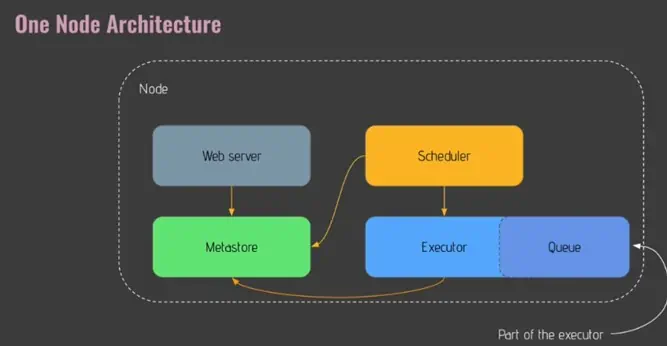
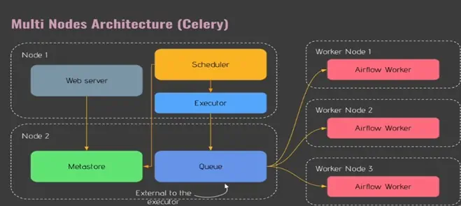

# Airflow Basics

## Apache Airflow is an open source plaform to **programmatically author, schedule** and **monitor** workflows. 

# Benefits
- Dyanimic
- Scalable
- UI
- Extensibility

# Core Components
## Web Server 
Flask server serving the UI
## Scheduler 
Daemon in charge of scheduling workflows
## Metastore 
Database where metadata is stored
## Executer
Class defining <u>**how**</u> your tasks should be executed. 
## Worker 
Process/sub process <u>**executing**</u> your taks

# DAG
- A DAG stands for Directed Acyclic Graph.
- In Apache Airflow, a DAG represents a workflow or a collection of tasks.
- It defines the order and dependencies between tasks.
- DAGs are composed of operators and their relationships, forming a directed acyclic graph structure.

# Operator
- An operator represents a single task or action to be performed within a workflow.
- Operators define what needs to be done, such as running a Python script, executing a SQL query, or transferring data.
- Each operator performs a specific action or computation.
- Operators can have dependencies on other operators, determining the execution order of tasks.

# Task instance
- A task instance is a specific occurrence or execution of a task within a workflow.
- For each task in a DAG, there can be multiple task instances.
- Task instances are associated with a specific execution date and time.
- Airflow manages the scheduling and execution of task instances based on their dependencies and execution policies.

# Workflow
- A workflow refers to the entire process or sequence of tasks that need to be executed.
- It encompasses the DAG, operators, and task instances.
- Workflows define the logical and operational flow of tasks, specifying dependencies and triggering mechanisms.
- Apache Airflow enables the orchestration and automation of workflows, ensuring reliable execution.

# How Airflow works? 

## One Node Architecture

**Web server** – provides Web UI  
**Scheduler** – schedules your tasks, pipelines, and workers  
**Metastore** – stores metadata from tasks – usually uses PostgreSQL  
**Executor** – An executor is a definition of how your task will be executed  
**Queue**  – The queue defines the order in which tasks will be executed. It is part of the Executor in the one-node architecture  
**Worker** – This is the actual process when a task is being executed; It is different from the Executor.
If you choose the One Node architecture then Airflow’s core components would be combined in one node. Moreover, the Queue would be a part of the Executor.

## Multi Nodes Architecture (Celery)

This architecture consists of a central scheduler, a metadata database, and multiple worker nodes.  
- **The scheduler** is responsible for orchestrating task execution and maintaining the overall workflow state  
- **the metadata database** stores information about tasks, their dependencies, and their execution history. 
- **The worker nodes** are responsible for executing tasks in parallel across the cluster.  
- When a workflow is triggered, the scheduler assigns tasks to available worker nodes based on their capabilities and resource availability. 
- Each worker node independently pulls tasks from the scheduler and executes them, reporting back the status and results. 
 
 This distributed approach enables efficient task execution, resource utilization, and fault tolerance, making Airflow suitable for handling large-scale and complex workflows.