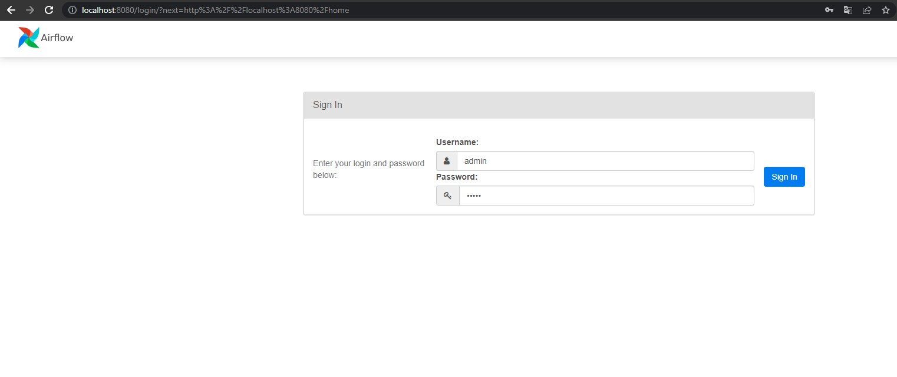
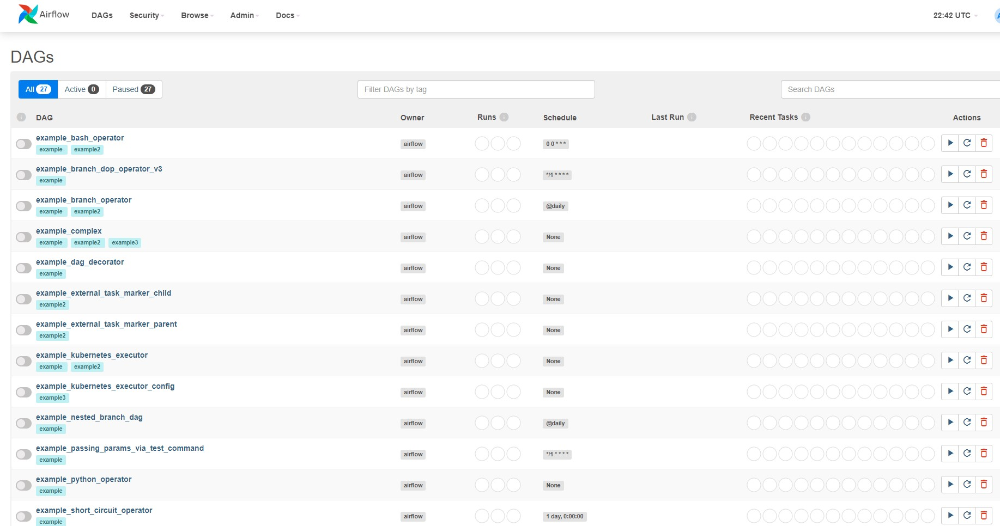
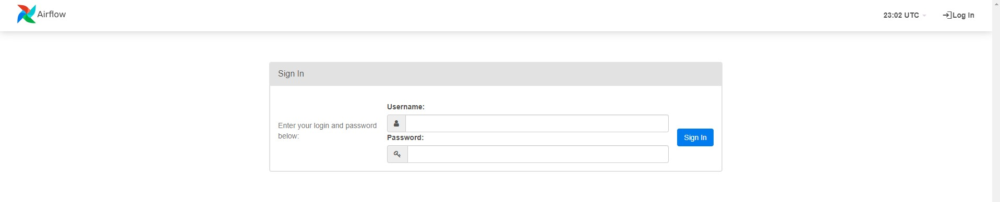

# Install Airflow Manually and with Docker


## Installing Airflow Manually

Create and start a docker container from the Docker image python:3.8-slim and execute the command /bin/bash in order to have a shell session
```bash
docker run -it --rm -p 8080:8080 python:3.8-slim /bin/bash

Unable to find image 'python:3.8-slim' locally
3.8-slim: Pulling from library/python
5b5fe70539cd: Pull complete
f4b0e4004dc0: Pull complete
1ad6212abe26: Pull complete
6959d97360ba: Pull complete
fc24c6e95ddc: Pull complete
Digest: sha256:10e07e36f86af4371accc42642852aa60eab74e6896fc065345ebc2c576eec0d
Status: Downloaded newer image for python:3.8-slim
```
Print the Python version
```bash
python -V
Python 3.8.17  
```

Export the environment variable AIRFLOW_HOME used by Airflow to store the dags folder, logs folder and configuration file
```bash
export AIRFLOW_HOME=/usr/local/airflow
```
To check that the environment variable has been well exported

```bash
env | grep airflow
AIRFLOW_HOME=/usr/local/airflo
```

Install all tools and dependencies that can be required by Airflow

```bash
apt-get update -y && apt-get install -y wget libczmq-dev curl libssl-dev git inetutils-telnet bind9utils freetds-dev libkrb5-dev libsasl2-dev libffi-dev libpq-dev freetds-bin build-essential default-libmysqlclient-dev apt-utils rsync zip unzip gcc && apt-get clean
```

Create the user airflow, set its home directory to the value of AIRFLOW_HOME and log into it
```bash
useradd -ms /bin/bash -d ${AIRFLOW_HOME} airflow
```

Show the file /etc/passwd to check that the airflow user has been created
```bash
cat /etc/passwd | grep airflow
airflow:x:1000:1000::/usr/local/airflow:/bin/bash
```

Upgrade pip (already installed since we use the Docker image python 3.5)

```bash
pip install --upgrade pip
```

Log into airflow
```bash
su - airflow
```

Create the virtual env named sandbox
```bash
python -m venv .sandbox
```
Activate the virtual environment sandbox
```bash
source .sandbox/bin/activate
(.sandbox) airflow@74ff68ede1f7:~$ 
```

Download the requirement file to install the right version of Airflow’s dependencies 
```bash
wget https://raw.githubusercontent.com/apache/airflow/constraints-2.0.2/constraints-3.8.txt
```
Install the version 2.0.2 of apache-airflow with all subpackages defined between square brackets. (Notice that you can still add subpackages after all, you will use the same command with different subpackages even if Airflow is already installed)
```bash
pip install "apache-airflow[crypto,celery,postgres,cncf.kubernetes,docker]"==2.0.2 --constraint ./constraints-3.8.txt
```
make sure you are in /usr/local/airflow folder
Initialise the metadatabase
```bash
airflow db init
DB: sqlite:////usr/local/airflow/airflow/airflow.db
[2023-06-26 22:26:14,887] {db.py:684} INFO - Creating tables
...
...
...
Initialization done
(.sandbox) airflow@74ff68ede1f7:~$ ls
airflow  constraints-3.8.txt
(.sandbox) airflow@74ff68ede1f7:~$ cd airflow/
(.sandbox) airflow@74ff68ede1f7:~/airflow$ ls
airflow.cfg  airflow.db  logs  webserver_config.py
```
1. airflow.cfg: The airflow.cfg file is the main configuration file for Airflow. It contains various settings and parameters that control the behavior of Airflow. You can customize options such as the database connection, executor type, logging configuration, authentication settings, and more by modifying this file. It is located in the Airflow installation directory and is essential for configuring and customizing Airflow according to your needs.

2. airflow.db: The airflow.db file refers to the SQLite database used by Airflow to store metadata about your workflows, tasks, and their execution history. It keeps track of the state and execution details of your workflows. By default, this file is created in the "AIRFLOW_HOME" directory (which can be specified in the airflow.cfg file) and contains tables to store information related to tasks, connections, variables, and more. The database is crucial for Airflow to maintain workflow state and history.

3. logs: The logs directory in Airflow is the default location where log files are stored. When tasks are executed, Airflow generates logs that provide information about the task's execution, status, and any output or errors encountered. The logs directory usually resides within the "AIRFLOW_HOME" directory. It helps you diagnose issues, monitor task execution, and troubleshoot any errors that may occur during workflow execution.

4. webserver_config: The webserver_config file (sometimes referred to as airflow-webserver.cfg) is an optional configuration file specific to the Airflow web server. It allows you to override certain settings for the web server component, such as the host, port, authentication options, and more. This file can be used to customize the behavior of the Airflow web interface and is typically located in the same directory as the airflow.cfg file.

In summary, airflow.cfg is the main configuration file for Airflow, airflow.db is the SQLite database used to store workflow metadata, logs directory stores the log files generated during task execution, and webserver_config is an optional configuration file for customizing the Airflow web server's behavior. These files and directories play important roles in the setup, configuration, and operation of Airflow.

Start Airflow’s scheduler in background
```bash
airflow scheduler &
[1] 2175
(.sandbox) airflow@74ff68ede1f7:~/airflow$   ____________       _____________
 ____    |__( )_________  __/__  /________      __
____  /| |_  /__  ___/_  /_ __  /_  __ \_ | /| / /
___  ___ |  / _  /   _  __/ _  / / /_/ /_ |/ |/ /
 _/_/  |_/_/  /_/    /_/    /_/  \____/____/|__/
[2023-06-26 22:33:03,695] {scheduler_job.py:1251} INFO - Starting the scheduler
```
Create a user

```bash
airflow users create  -u admin -f admin -l admin -r Admin -e admin@airflow.com -p admin
```
Start Airflow’s webserver in background
```bash
airflow webserver &
```

Open a tab in your web browser and tab `localhost:8080` to check the installation. 
user: admin
password: admin



## Install Airflow with Docker

Build a docker image from the Dockerfile (make sure you are in the current directory where the dockerfile, entrypoint and constraint files are) and name it airflow-basic

```bash
docker build -t airflow-basic .
```

Check the image was created

```bash
docker image ls
REPOSITORY                                  TAG           IMAGE ID       CREATED          SIZE
airflow-basic                               latest        440147572f3b   45 seconds ago   992MB
...                                         ...           ...            ...              ...
```

Run the container 
```bash
docker run --rm -d -p 8080:8080 airflow-basic
```

Go to the web browser and you should see



