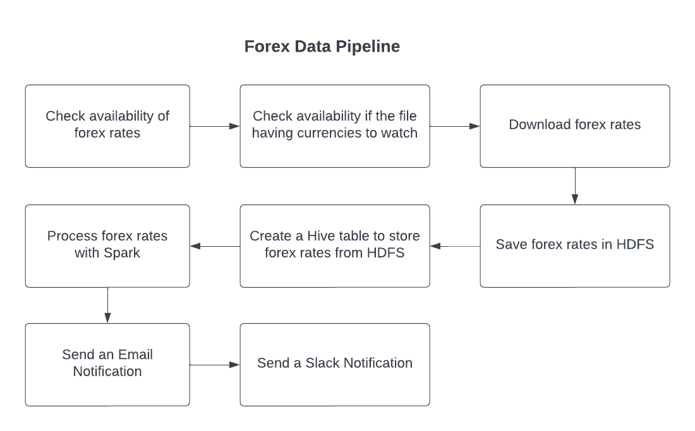

# Forex Data Pipeline



## About the Docker Compose File. 

In the docker-compose file, each service is a cointainer that runs for the application. Each service is built based on a its Dockerfile. 

docker-compose.yml
```yaml
######################################################
# AIRFLOW
######################################################

  airflow:
    build: ./docker/airflow
    restart: always
    container_name: airflow
    volumes:
      - ./mnt/airflow/airflow.cfg:/opt/airflow/airflow.cfg
      - ./mnt/airflow/dags:/opt/airflow/dags
    ports:
      - 8080:8080
    healthcheck:
      test: [ "CMD", "nc", "-z", "airflow", "8080" ]
      timeout: 45s
      interval: 10s
      retries: 10
```
in the `volumes` parameter, we are saying that the dags created in <mark>/mnt/airflow/dags</mark> is binded with <mark>/opt/airflow/dags</mark> inside the docker container. So the files that we put in <mark>/mnt/airflow/dags</mark> in the local machine will be synchornized with the folder dags inside the Airflow docker container. This applies also with local <mark>/mnt/airflow/airflow.cfg</mark> and <mark>opt/airflow/airflow.cfg</mark> inside the container. 

# Create DAG

1. Import DAG object
2. Specify dictionary with arguments applied to all the tasks
3. Instantiate Dag object

```python
from airflow import DAG
from datetime import datetime,timedelta

default_args = {
    "owner": "airflow", 
    "email_on_failure": False,
    "email_on_retry": False, 
    "email": "admin@localhost.com", 
    "retries": 1, 
    "retry_delay": timedelta(minutes=5)
}

with DAG(dag_id="forex_data_pipeline",
        start_date=datetime.datetime(2023, 1, 1),
        schedule_interval="@daily", 
        default_args=default_args, 
        catchup=False) as dag:

```

# Operators
- Operators represent individual tasks within a workflow or DAG.
- Operators define the logic and actions to be performed by each task in a workflow.
- There are several types of operators available in Airflow, each serving a specific purpose:
  - BashOperator: Executes a bash command or script.
  - PythonOperator: Executes a Python callable or function.
  - SQLOperator: Executes SQL queries on a database.
  - DummyOperator: Represents a task without any actual functionality.
  - EmailOperator: Sends an email notification.
  - BranchPythonOperator: Performs branching logic based on a Python function.
  - FileSensor: Waits for a file or directory to be available or match a certain condition.
  - HttpSensor: Waits for an HTTP endpoint to return a specific response.
- Custom operators can also be created by extending the base operator classes provided by Airflow.
- Operators can be used to manage dependencies between tasks, define retries and retries delays, set up task-level timeouts, and handle task execution parameters.
- Airflow provides both "sensors" and "operators" for different purposes. While operators perform tasks, sensors wait for certain conditions to be met before proceeding with the workflow.
- Operators are typically defined and organized within a DAG file, which represents the overall workflow structure in Airflow.

## Types of Operators
### Action Operators:
- Action operators in Airflow are a specific type of operator that performs an action or executes a task. These operators are typically used to interact with external systems or services.
- Action operators encapsulate the logic required to perform specific actions, such as running a command, triggering an API call, or executing a script.
- Examples of action operators in Airflow include BashOperator, PythonOperator, EmailOperator, and SQL operators like MySqlOperator or PostgresOperator.
- Action operators are responsible for carrying out the core tasks within a workflow or DAG.

### Transfer Operators:
- Transfer operators in Airflow are designed to facilitate the movement of data between different systems or components.
- These operators are used to transfer or transform data from one location or format to another, often integrating with external systems or services.
- Transfer operators enable workflows to handle data ingestion, transformation, extraction, loading, synchronization, and more.
- Examples of transfer operators in Airflow include operators like S3ToGoogleCloudStorageOperator, SFTPOperator, or GCSToBigQueryOperator.
- Transfer operators play a crucial role in data pipelines, allowing data to flow seamlessly between various data sources, data warehouses, databases, or cloud storage platforms.

### Sensor Operators:
- Sensor operators in Airflow are a specialized type of operator that wait for a certain condition or state to be met before proceeding with the workflow.
- Sensor operators are typically used to monitor external resources or events and ensure that the workflow progresses only when specific conditions are satisfied.
- These operators are useful for tasks like waiting for a file to become available, checking the status of an API endpoint, or monitoring a database for changes.
- Examples of sensor operators in Airflow include FileSensor, HttpSensor, ExternalTaskSensor, or the recently introduced TimeDeltaSensor.
- Sensor operators allow workflows to react to real-time changes or external events, making them essential for building robust and responsive data pipelines.